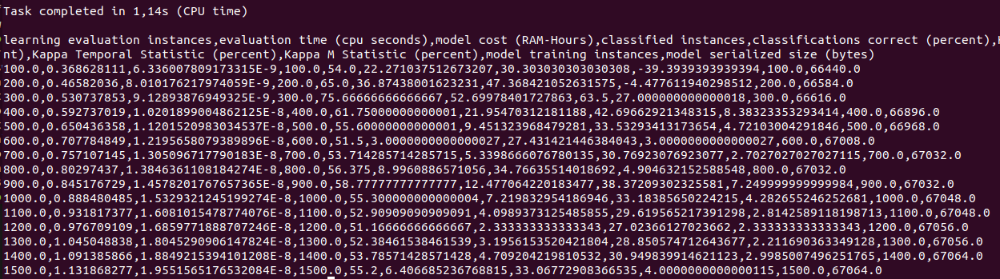

# Abstract

`MOAFS` is a library for the [Massive Online Analysis](https://moa.cms.waikato.ac.nz/) framework. It is based on the [MOAReduction](https://linkinghub.elsevier.com/retrieve/pii/S0925231217302631) extension and contains the implementation of seven feature selection algorithms to be used as dimensionality reduction techniques in data streams classification problems, especially in the text-domain field. `MOAFS` uses an incremental version of Naïve Bayes as the base classifier.

# Available algorithms

### Information Gain and Gain Ratio

* QUINLAN, J. R. Induction of Decision Trees. Machine Learning, v. 1, n. 1, p. 81–106, 1986. ISSN 1573-0565. DOI: 10.1023/A:1022643204877.

### Symmetrical Uncertainty

* YU, L.; LIU, H. Feature Selection for High-Dimensional Data: A Fast Correlation-Based Filter Solution. In: Twentieth International Conference on Machine Learning, 2003. Edition: T. Fawcett e N. Mishra. v. 2, p. 856–863. ISBN 1577351894.

### Online Feature Selection

* J. Wang, P. Zhao, S. Hoi, R. Jin, Online feature selection and its applications, IEEE Transactions on Knowledge and Data Engineering 26 (3) (2014) 698–710.

### Chi-Squared

* PEARSON, K. On the Criterion that a Given System of Deviations from the Probable in the Case of a Correlated System of Variables is Such that it Can be Reasonably Supposed to have Arisen from Random Sampling. In: Breakthroughs in Statistics: Methodology and Distribution. Edition: Samuel Kotz e Norman L. Johnson. New York, NY: Springer New York, 1992. p. 11–28. ISBN 978-1-4612-4380-9. DOI: 10.1007/978-1-4612-4380-9_2.

### Crammers V-Test

* Cramér, Harald. 1946. Mathematical Methods of Statistics. Princeton: Princeton University Press, page 282 (Chapter 21. The two-dimensional case). ISBN 0-691-08004-6

### Extremal Feature Selection

* CARVALHO, V. R.; COHEN, W. W. Single-pass Online Learning: Performance, Voting Schemes and Online Feature Selection. In: 12 ACM SIGKDD International
Conference on Knowledge Discovery and Data Mining. Philadelphia, PA, USA: ACM, 2006. (KDD ’06), p. 548–553. ISBN 1-59593-339-5. DOI: 10.1145/1150402.1150466.

# Documentation

For futher documentation, please refer to the <a href="https://moafs.readthedocs.io/en/latest/"><strong>Docs</strong></a>.

# Installation and requirements

Simply download the [moafs.jar](https://github.com/mbdemoraes/moafs/raw/master/lib/moafs.jar) from the lib directory in this repository and add the file to the "lib" folder in the directory where MOA is installed. Then, from the same folder, use the follow command:

### Example on Windows 

From the lib folder where your MOA is installed:

> java -cp .;moafs.jar;moa.jar -javaagent:sizeofag-1.0.4.jar moa.gui.GUI

Or using jar's full location:

> java -cp .;moa-release-2018.6.0/lib/moafs.jar;moa-release-2018.6.0/lib/moa.jar -javaagent:moa-release-2018.6.0/lib/sizeofag-1.0.4.jar moa.gui.GUI

### Example on Linux/Mac 

From the lib folder where your MOA is installed:

> java -cp moafs.jar:moa.jar -javaagent:sizeofag-1.0.4.jar moa.gui.GUI

Or using full location:

> java -cp moa-release-2018.6.0/lib/moa.jar:./moa.jar-javaagent:moa-release-2018.6.0/lib/sizeofag-1.0.4.jar moa.gui.GUI

### Requirements

* Java 8;
* [MOA v2018.06](https://moa.cms.waikato.ac.nz/downloads/).

# Parameters

`MOAFS` uses a set of different parameters:

* -f: Reduction rate - The number of features to select (default = 10)
* -w: Processing window -  The number of instances to process using the specified reduction rate (default = 1)
* -m: Feature Selection Method - Feature selection method to be used. Options: 
    * 0 = No method;
    * 1 = Information Gain;
    * 2 = Symmetrical Uncertainty;
    * 3 = Chi-Squared;
    * 4 = Cramers V-Test;
    * 5 = Gain Ratio;
    * 6 = Extremal Feature Selection;
    * 7 = Online Feature Selection.

# Sample datasets

This repository contains some sample datasets at the `sample datasets` folder, which may be used for experiments. They were obtained from different sources:

* usenet1, usenet2, usenet3, spam-data and emailing_list were collected by The Machine Learning and Knowledge Discovery (MLKD) group and can be found at [Concept Drifting Datasets in Weka](http://mlkd.csd.auth.gr/datasets.html);
* spambase, gas_sensor, semeion, enron and synthetic_control were obtained at [UCI](https://archive.ics.uci.edu/ml/index.php)
* usenet_recurrent was collected by Dr. Gama and can be found at [Datasets for Concept Drift](http://www.liaad.up.pt/kdus/products/datasets-for-concept-drift)

# Sample outputs

This repository contains sample outputs using the presented feature selection algorithms using the usenet1 dataset at the `sample outputs` folder.

# Examples from the command line (Linux)

Here is an example using the Interleaved-Test-Then-Train approach with the Chi-Squared algorithm on the [Usenet1](http://mlkd.csd.auth.gr/datasets.html) data set, selecting 20 features:

```
java -cp moafs.jar:moa.jar -javaagent:sizeofag-1.0.4.jar moa.DoTask "EvaluateInterleavedTestThenTrain -l (moa.featureselection.classifiers.NaiveBayes -f 20 -m 3) -s (ArffFileStream -f /home/athos/Documentos/datasets/usenet1.arff) -f 100"
```

This should generate a similar results screen:


<p align="left">

</p>

# License

Distributed under the GNU General Public License v3.0 License. See `LICENSE` for more information.

# Contact

If you wish to contribute to the software, report issues or problems or seek suport, feel free to use the issue report of this repository or to contact us.

Matheus Bernardelli de Moraes -- matheuzmoraes@gmail.com

André Leon S. Gradvohl -- gradvohl@ft.unicamp.br

