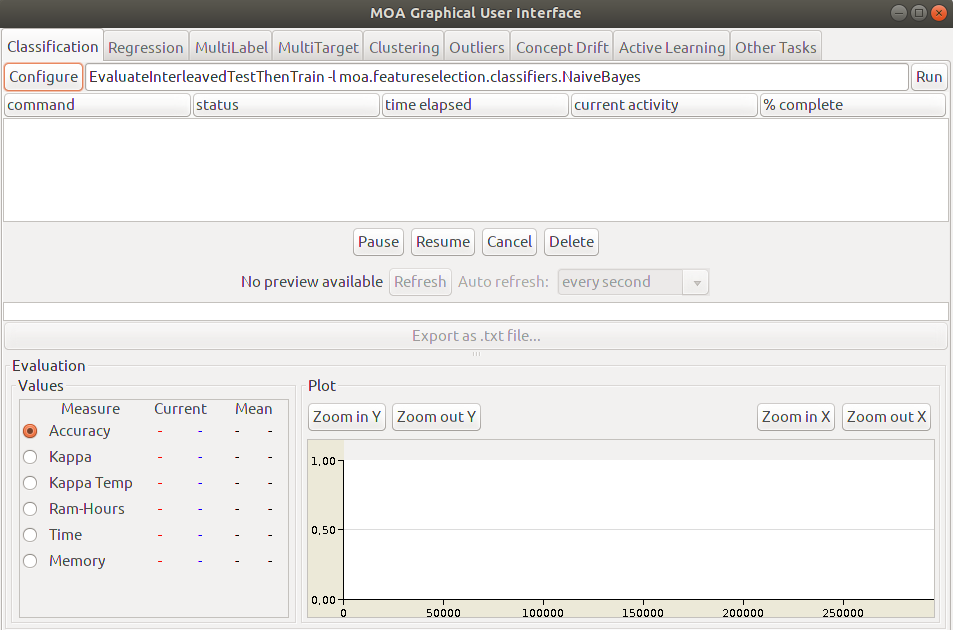
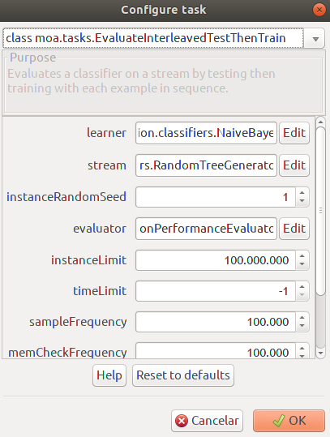
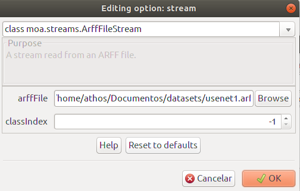
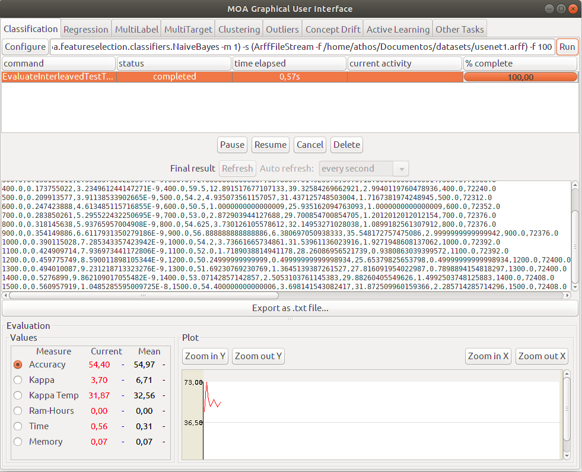
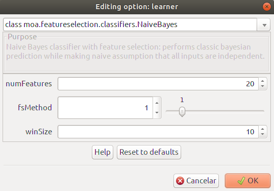
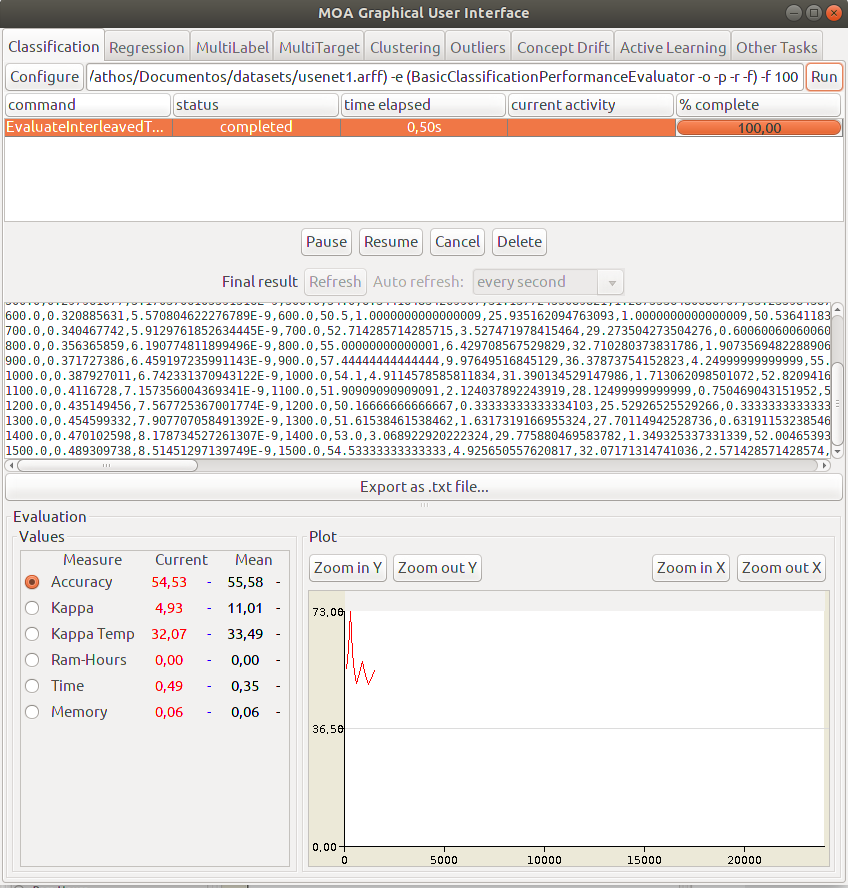

Examples (GUI)
==============

If you want to use ``MOAFS`` in MOA's graphical user interface (GUI), you can use the following command from a terminal (Linux/MAC) from the ``lib`` folder
where your MOA is installed:

.. code-block:: bash

  java -cp moafs.jar:moa.jar -javaagent:sizeofag-1.0.4.jar moa.gui.GUI

Or if you are using Windows:

.. code-block:: bash

    java -cp .;moafs.jar;moa.jar -javaagent:sizeofag-1.0.4.jar moa.gui.GUI

If everything is OK, MOA's GUI should appear as illustrated in the figure below.

Then, click on ``Configure`` button on the left side. The ``Configure Task`` window should appear. Select ``class moa.tasks.EvaluateInterleavedTestThenTrain`` in the
first dropdown list.

Still on the ``Configure Task`` window, on ``learner`` options, click on the ``Edit`` button. The ``Editing option: learner`` window should be presented. Select
``class moa.featureselection.classifiers.NaiveBayes`` on the first dropdown list. Three options must be presented as ilustrated in the figure below. 
With these three options, you can select the number of features to be selected, the feature selection method and the processing window size.

.. image:: _static/moafs_03.png
  :width: 50 %

To select a data set from a local directory, on the ``Configure Task`` window, on ``stream`` options, click on the ``Edit`` button. 

Then, ``Editing option: stream`` window should be presented. Select
``class moa.streams.ArffFileStream`` on the first dropdown list. Then you can select the data set from the ``arffFile`` option.

If everything is according to plan, just press the ``OK`` button on all windows and you will be returned to the main page. There, just click on the ``Run`` button on the right side and MOA
will perform the classification of the data set using the selected feature selection method.

Classification without feature selection (No method)
----------------------------------------------------

.. image:: _static/moafs_03.png
  :width: 50 %

Select a desired number of features on ``numFeatures`` and the window size on ``winSize`` options. For the ``fsMethod``, leave it as zero. Therefore, no feature
selection method will be used for the classification process. 

To select a data set from a local directory, on the ``Configure Task`` window, on ``stream`` options, click on the ``Edit`` button. 

Then, ``Editing option: stream`` window should be presented. Select
``class moa.streams.ArffFileStream`` on the first dropdown list. Then you can select the data set from the ``arffFile`` option.

If everything is according to plan, just press the ``OK`` button on all windows and you will be returned to the main page. There, just click on the ``Run`` button on the right side and MOA
will perform the classification of the data set using the selected feature selection method.

Information Gain
-----------------

Select a desired number of features on ``numFeatures`` and the window size on ``winSize`` options. For the ``fsMethod``, set it to 1. 

Select a data set from a local directory, on the ``Configure Task`` window, on ``stream`` options, click on the ``Edit`` button. 

Then, ``Editing option: stream`` window should be presented. Select
``class moa.streams.ArffFileStream`` on the first dropdown list. Then you can select the data set from the ``arffFile`` option.

If everything is according to plan, just press the ``OK`` button on all windows and you will be returned to the main page. There, just click on the ``Run`` button on the right side and MOA
will perform the classification of the data set using the selected feature selection method.

