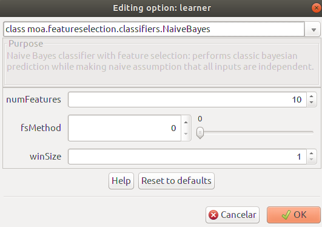

Examples (GUI)
==============

If you want to use ``MOAFS`` in MOA's graphical user interface (GUI), you can use the following command from a terminal (Linux/MAC) from the ``lib`` folder
where your MOA is installed:

.. code-block:: bash

  java -cp moafs.jar:moa.jar -javaagent:sizeofag-1.0.4.jar moa.gui.GUI

Or if you are using Windows:

.. code-block:: bash

    java -cp .;moafs.jar;moa.jar -javaagent:sizeofag-1.0.4.jar moa.gui.GUI

If everything is OK, MOA's GUI should appear as illustrated in the figure below.

Classification without feature selection (No method)
----------------------------------------------------

Click on ``Configure`` button on the left side. The ``Configure Task`` window should appear. Select ``class moa.tasks.EvaluateInterleavedTestThenTrain`` in the
first dropdown list.

.. image:: _static/moafs_02.png
  :width: 50 %

Still on the ``Configure Task`` window, on ``learner`` options, click on the ``Edit`` button. The ``Editing option: learner`` window should be presented. Select
``class moa.featureselection.classifiers.NaiveBayes`` on the first dropdown list. Three options must be presented as ilustrated in the figure below. 
With these options, you can select the number of relevant features to be selected, the feature selection method and the processing window size. To perform
classification without feature selection, set ``fsMethods`` to 0.

To select a data set from a local directory, on the ``Configure Task`` window, on ``stream`` options, click on the ``Edit`` button. 

.. image:: _static/moafs_02.png
  :width: 50 %

Then, ``Editing option: stream`` window should be presented. Select
``class moa.streams.ArffFileStream`` on the first dropdown list. Then you can select the data set from the ``arffFile`` option. Click ``OK`` and then ``OK`` again.

.. image:: _static/moafs_04.png
  :width: 50 %

If everything is according to plan, just press the ``OK`` button on all windows and you will be returned to the main window. There, just click on the ``Run`` button on the right side and MOA
will perform the classification of the data set using the selected feature selection method.

Information Gain
-----------------

Click on ``Configure`` button on the left side. The ``Configure Task`` window should appear. Select ``class moa.tasks.EvaluateInterleavedTestThenTrain`` in the
upper dropdown list.

.. image:: _static/moafs_02.png
  :width: 50 %

On the ``Configure Task`` window, on ``learner`` options, click on the ``Edit`` button. The ``Editing option: learner`` window should be presented. Select
``class moa.featureselection.classifiers.NaiveBayes`` on the first dropdown list. 

.. image:: _static/moafs_07.png
  :width: 50 %

Select a desired number of features on ``numFeatures`` and the window size on ``winSize`` options. To use Information Gain as a feature selection method,
simply set ``fsMethod`` to 1. If everything is set up accordingly, click ``OK``. 

To select a data set from a local directory, on the ``Configure Task`` window, on ``stream`` options, click on the ``Edit`` button.

.. image:: _static/moafs_02.png
  :width: 50 %

Then, ``Editing option: stream`` window should be presented. Select
``class moa.streams.ArffFileStream`` on the first dropdown list. Then you can select the data set from the ``arffFile`` option. Click ``OK`` and then ``OK`` again.

.. image:: _static/moafs_04.png
  :width: 50 %

You will return to the main page. There, just click on the ``Run`` button on the right side and MOA
will perform the classification of the data set using Information Gain as the selected feature selection method.

Symmetrical Uncertainty
------------------------

Click on ``Configure`` button on the left side. The ``Configure Task`` window should appear. Select ``class moa.tasks.EvaluateInterleavedTestThenTrain`` in the
upper dropdown list.

.. image:: _static/moafs_02.png
  :width: 50 %

On the ``Configure Task`` window, on ``learner`` options, click on the ``Edit`` button. The ``Editing option: learner`` window should be presented. Select
``class moa.featureselection.classifiers.NaiveBayes`` on the first dropdown list. 

.. image:: _static/moafs_sym.png
  :width: 50 %

Select a desired number of features on ``numFeatures`` and the window size on ``winSize`` options. To use Symmetrical Uncertainty as a feature selection method,
simply set ``fsMethod`` to 2. If everything is set up accordingly, click ``OK``. 

To select a data set from a local directory, on the ``Configure Task`` window, on ``stream`` options, click on the ``Edit`` button.

.. image:: _static/moafs_02.png
  :width: 50 %

Then, ``Editing option: stream`` window should be presented. Select
``class moa.streams.ArffFileStream`` on the first dropdown list. Then you can select the data set from the ``arffFile`` option. Click ``OK`` and then ``OK`` again.

.. image:: _static/moafs_04.png
  :width: 50 %

You will return to the main page. There, just click on the ``Run`` button on the right side and MOA
will perform the classification of the data set using Information Gain as the selected feature selection method.

.. image:: _static/moafs_results_sym.png
  :width: 100 %

Chi-Squared
------------

Click on ``Configure`` button on the left side. The ``Configure Task`` window should appear. Select ``class moa.tasks.EvaluateInterleavedTestThenTrain`` in the
upper dropdown list.

.. image:: _static/moafs_02.png
  :width: 50 %

On the ``Configure Task`` window, on ``learner`` options, click on the ``Edit`` button. The ``Editing option: learner`` window should be presented. Select
``class moa.featureselection.classifiers.NaiveBayes`` on the first dropdown list. 

.. image:: _static/moafs_chi.png
  :width: 50 %

Select a desired number of features on ``numFeatures`` and the window size on ``winSize`` options. To use Chi-Squared as a feature selection method,
simply set ``fsMethod`` to 3. If everything is set up accordingly, click ``OK``. 

To select a data set from a local directory, on the ``Configure Task`` window, on ``stream`` options, click on the ``Edit`` button.

.. image:: _static/moafs_02.png
  :width: 50 %

Then, ``Editing option: stream`` window should be presented. Select
``class moa.streams.ArffFileStream`` on the first dropdown list. Then you can select the data set from the ``arffFile`` option. Click ``OK`` and then ``OK`` again.

.. image:: _static/moafs_04.png
  :width: 50 %

You will return to the main page. There, just click on the ``Run`` button on the right side and MOA
will perform the classification of the data set using Chi-Squared as the selected feature selection method.

.. image:: _static/moafs_results_chi.png
  :width: 100 %

Cramers V-Test
---------------

Click on ``Configure`` button on the left side. The ``Configure Task`` window should appear. Select ``class moa.tasks.EvaluateInterleavedTestThenTrain`` in the
upper dropdown list.

.. image:: _static/moafs_02.png
  :width: 50 %

On the ``Configure Task`` window, on ``learner`` options, click on the ``Edit`` button. The ``Editing option: learner`` window should be presented. Select
``class moa.featureselection.classifiers.NaiveBayes`` on the first dropdown list. 

.. image:: _static/moafs_cramers.png
  :width: 50 %

Select a desired number of features on ``numFeatures`` and the window size on ``winSize`` options. To use Cramers V-Test as a feature selection method,
simply set ``fsMethod`` to 4. If everything is set up accordingly, click ``OK``. 

To select a data set from a local directory, on the ``Configure Task`` window, on ``stream`` options, click on the ``Edit`` button.

.. image:: _static/moafs_02.png
  :width: 50 %

Then, ``Editing option: stream`` window should be presented. Select
``class moa.streams.ArffFileStream`` on the first dropdown list. Then you can select the data set from the ``arffFile`` option. Click ``OK`` and then ``OK`` again.

.. image:: _static/moafs_04.png
  :width: 50 %

You will return to the main page. There, just click on the ``Run`` button on the right side and MOA
will perform the classification of the data set using Cramers V-Test as the selected feature selection method.

Gain Ratio
----------

Click on ``Configure`` button on the left side. The ``Configure Task`` window should appear. Select ``class moa.tasks.EvaluateInterleavedTestThenTrain`` in the
upper dropdown list.

.. image:: _static/moafs_02.png
  :width: 50 %

On the ``Configure Task`` window, on ``learner`` options, click on the ``Edit`` button. The ``Editing option: learner`` window should be presented. Select
``class moa.featureselection.classifiers.NaiveBayes`` on the first dropdown list. 

.. image:: _static/moafs_gain.png
  :width: 50 %

Select a desired number of features on ``numFeatures`` and the window size on ``winSize`` options. To use Gain Ratio as a feature selection method,
simply set ``fsMethod`` to 5. If everything is set up accordingly, click ``OK``. 

To select a data set from a local directory, on the ``Configure Task`` window, on ``stream`` options, click on the ``Edit`` button.

.. image:: _static/moafs_02.png
  :width: 50 %

Then, ``Editing option: stream`` window should be presented. Select
``class moa.streams.ArffFileStream`` on the first dropdown list. Then you can select the data set from the ``arffFile`` option. Click ``OK`` and then ``OK`` again.

.. image:: _static/moafs_04.png
  :width: 50 %

You will return to the main page. There, just click on the ``Run`` button on the right side and MOA
will perform the classification of the data set using Gain Ratio as the selected feature selection method.

Extremal Feature Selection
--------------------------

Click on ``Configure`` button on the left side. The ``Configure Task`` window should appear. Select ``class moa.tasks.EvaluateInterleavedTestThenTrain`` in the
upper dropdown list.

.. image:: _static/moafs_02.png
  :width: 50 %

On the ``Configure Task`` window, on ``learner`` options, click on the ``Edit`` button. The ``Editing option: learner`` window should be presented. Select
``class moa.featureselection.classifiers.NaiveBayes`` on the first dropdown list. 

.. image:: _static/moafs_efs.png
  :width: 50 %

Select a desired number of features on ``numFeatures`` and the window size on ``winSize`` options. To use Extremal Feature Selection as a feature selection method,
simply set ``fsMethod`` to 6. If everything is set up accordingly, click ``OK``. 

To select a data set from a local directory, on the ``Configure Task`` window, on ``stream`` options, click on the ``Edit`` button.

.. image:: _static/moafs_02.png
  :width: 50 %

Then, ``Editing option: stream`` window should be presented. Select
``class moa.streams.ArffFileStream`` on the first dropdown list. Then you can select the data set from the ``arffFile`` option. Click ``OK`` and then ``OK`` again.

.. image:: _static/moafs_04.png
  :width: 50 %

You will return to the main page. There, just click on the ``Run`` button on the right side and MOA
will perform the classification of the data set using Extremal Feature Selection as the selected feature selection method.

.. image:: _static/moafs_results_efs.png
  :width: 100 %

Online Feature Selection
-------------------------

Click on ``Configure`` button on the left side. The ``Configure Task`` window should appear. Select ``class moa.tasks.EvaluateInterleavedTestThenTrain`` in the
upper dropdown list.

.. image:: _static/moafs_02.png
  :width: 50 %

On the ``Configure Task`` window, on ``learner`` options, click on the ``Edit`` button. The ``Editing option: learner`` window should be presented. Select
``class moa.featureselection.classifiers.NaiveBayes`` on the first dropdown list. 

Select a desired number of features on ``numFeatures`` and the window size on ``winSize`` options. To use online Feature Selection as a feature selection method,
simply set ``fsMethod`` to 7. If everything is set up accordingly, click ``OK``. 

To select a data set from a local directory, on the ``Configure Task`` window, on ``stream`` options, click on the ``Edit`` button.

.. image:: _static/moafs_02.png
  :width: 50 %

Then, ``Editing option: stream`` window should be presented. Select
``class moa.streams.ArffFileStream`` on the first dropdown list. Then you can select the data set from the ``arffFile`` option. Click ``OK`` and then ``OK`` again.

.. image:: _static/moafs_04.png
  :width: 50 %

You will return to the main page. There, just click on the ``Run`` button on the right side and MOA
will perform the classification of the data set using Online Feature Selection as the selected feature selection method.

.. image:: _static/moafs_results_ofs.png
  :width: 100 %

