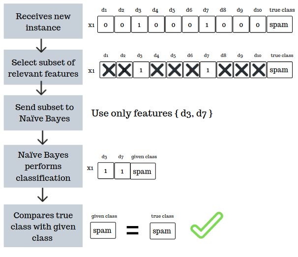

# Summary

Each feature selection algorithm performs efficiently depending on different circumstances, such as data dimensionality (low, medium, high or ultra), speed rate, attribute type (nominal or numerical), number of classes, among others. Therefore, to perform different experiments on some of the most relevant feature selection algorithms proposed for data streams classification problems, the Massive Online Analysis Feature Selection (`MOAFS`) was created. `MOAFS` is a library for the Massive Online Analysis (MOA) [@Bifet:2010] framework, and it is based on the MOAReduction [@Ramirez-Gallego:2017] extension. It contains seven feature selection algorithms to be used as dimensionality reduction techniques in data streams classification problems, especially in the text-domain field, since they are not directly available on MOA. `MOAFS` includes incremental versions of information-based filter algorithms such as Information Gain and Gain Ratio [@Quinlan:1986], Symmetrical Uncertainty used by the Fast Correlation-Based Filter [@Yu:2003], Chi-squared [@Pearson:1990] and Cramers V-Test [@Cramer:1946], as well as wrapper algorithms such as Online Feature Selection [@Wang:2014] and Extremal Feature Selection [@Carvalho:2006]. Therefore, `MOAFS` is a package for MOA to perform feature selection on data streams classification problems.

# Statement of need

Data streams are continuous, potentially unbounded, high volume and high dimensional data, which turns impracticable its storage in traditional database mechanisms [@Ramirez-Gallego:2017]. For its properties, data streams have to be processed and analyzed online. However, as it is potentially unbounded, data streams probabilistic distribution changes over time, the so-called Concept Drift phenomenon. This phenomenon turns the online data process and analysis completely dynamic. Using classification algorithms is one approach to learn from data streams, as it classifies data into different classes for future decisions. Nevertheless, data streams high dimensionality imposes a challenge on the classification process, since it increases both computational cost and time, as well as aggravate the concept drift impacts. To solve this problem, online feature selection algorithms have been proposed to reduce data streams dimensionality by removing irrelevant and redundant attributes from data streams. As shown in the figure below, feature selection methods affect the classification process in multiple forms. Using the appropriate method is an important step in the learning process, especially when handling the concept drift phenomenon.

# Library design

Using a feature selection method is optional in `MOAFS`. If no method is defined, the base classifier (Naïve Bayes) performs classification in a standard approach, using all available features. On the other hand, if a feature selection algorithm is selected, it determines the most relevant features before the classification step. Then, the method transfers the selected subset of features to the base classifier which then performs classification using only the given subset of features. The figure below presents a flowchart example of this process. Therefore, with `MOAFS`, it is possible to verify which feature selection method is more suitable under a specific scenario.

# Acknowledgements

This work was supported by the Brazilian Coordination for the Improvement of Higher Education Personnel (CAPES).

# References
